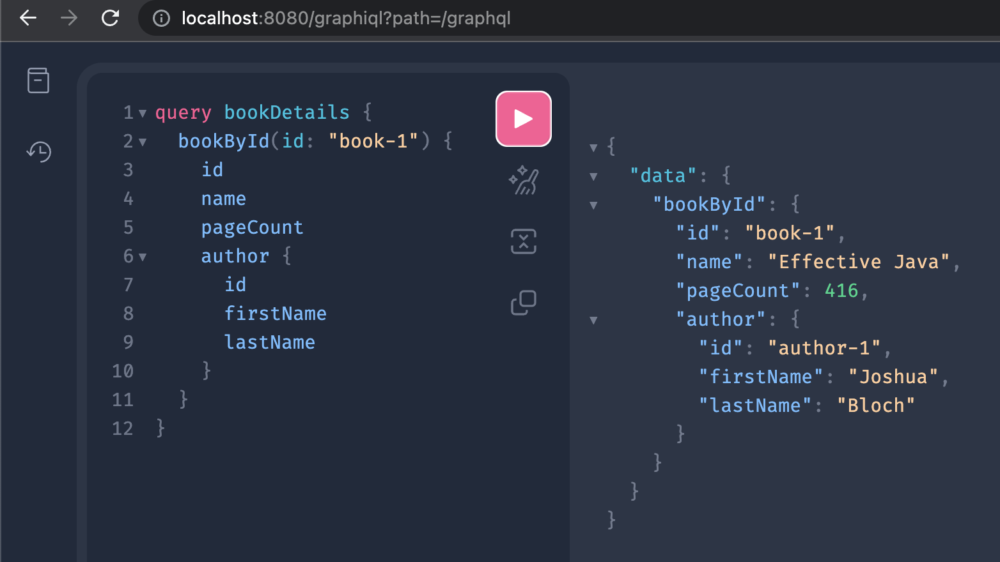

# Building a GraphQL service

This app is service in Java using Spring for GraphQL.

A service accept GraphQL requests at [http://localhost:8080/graphql](http://localhost:8080/graphql)

GraphiQL is a useful visual interface for writing and executing queries,
and much more [http://localhost:8080/graphiql](http://localhost:8080/graphiql)

## Technology stack:

* Java 17;
* Gradle
* Spring Boot
* GraphQL